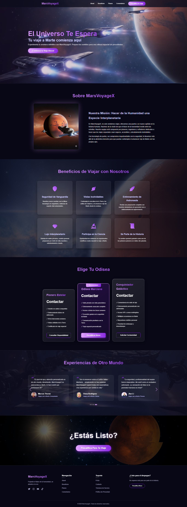

## Landing Page de Viajes a Marte - MarsVoyageX

 <!-- Reemplaza esto con una captura de pantalla de tu sección Hero -->

Bienvenido al repositorio de MarsVoyageX, una landing page conceptual y moderna para una compañía de turismo espacial. Este proyecto fue construido desde cero con React y se enfoca en crear una experiencia de usuario (UX) inmersiva y memorable a través de animaciones avanzadas y un diseño futurista.

---

## 🚀 Demo en Vivo

**[Ver la demo en vivo aquí](https://mars-travel-landing-page.netlify.app/)** <!-- Reemplaza esto con el enlace a tu sitio desplegado -->

---

## ✨ Características Principales

*   **Experiencia de Usuario Inmersiva:** Fondos de video y animaciones con GSAP que transportan al usuario al espacio.
*   **Animaciones Fluidas:** Interacciones y apariciones de componentes gestionadas con Framer Motion para una sensación moderna y pulida.
*   **Totalmente Responsivo:** Diseño adaptable que se ve y funciona perfectamente en dispositivos de escritorio, tabletas y móviles.
*   **Componentes Modulares:** Estructura de proyecto limpia y organizada, con cada sección encapsulada en su propio componente de React.
*   **Carrusel Interactivo:** Un carrusel de testimonios personalizable y responsive construido con Swiper.js.
*   **Modal de Conversión:** Un modal de "glassmorphism" con un formulario de precalificación y un mensaje de agradecimiento dinámico.
*   **Rendimiento Optimizado:** Uso estratégico de librerías de animación para asegurar una experiencia fluida sin sacrificar el rendimiento.

---

## 🛠️ Tecnologías Utilizadas

*   **Framework:** [React.js](https://reactjs.org/)
*   **Librerías de Animación:**
    *   [Framer Motion](https://www.framer.com/motion/): Para animaciones de UI, transiciones de estado e interacciones.
    *   [GSAP (GreenSock Animation Platform)](https://greensock.com/gsap/): Para animaciones complejas y de alto rendimiento en el fondo (ej. el planeta rotando).
*   **Carrusel:** [Swiper.js](https://swiperjs.com/)
*   **Iconos:** [React Icons](https://react-icons.github.io/react-icons/)
*   **Estilos:** CSS puro con un enfoque en Flexbox y Grid para el diseño responsivo.

---

## 🚀 Cómo Empezar (Instalación y Uso)

Sigue estos pasos para levantar el proyecto en tu entorno de desarrollo local.

### Prerrequisitos

*   Node.js (versión 16 o superior)
*   npm o yarn

### Pasos

1.  **Clona el repositorio:**
    ```bash
    git clone https://github.com/YoshuaSoto95/mars-travel-landing.git
    ```

2.  **Navega al directorio del proyecto:**
    ```bash
    cd mars-travel-landing
    ```

3.  **Instala las dependencias:**
    ```bash
    # Usando npm
    npm install

    # O usando yarn
    yarn install
    ```

4.  **Inicia el servidor de desarrollo:**
    ```bash
    # Usando npm
    npm start

    # O usando yarn
    yarn start
    ```

5.  **Abre tu navegador:**
    Visita [http://localhost:3000](http://localhost:3000) para ver la aplicación en acción.

---

## 📂 Estructura de Archivos

El proyecto está organizado siguiendo una estructura basada en componentes para facilitar la escalabilidad y el mantenimiento.

```/
├── public/
│   └── index.html
├── src/
│   ├── assets/              # Imágenes, videos y otros archivos estáticos
│   ├── components/          # Componentes reutilizables de React
│   │   ├── About/
│   │   ├── Benefits/
│   │   ├── CallToActionSection/
│   │   ├── Footer/
│   │   ├── Header/
│   │   ├── Hero/
│   │   ├── Modal/
│   │   ├── Plans/
│   │   └── Testimonials/
│   ├── App.css              # Estilos globales
│   ├── App.js               # Componente principal que une todo
│   ├── index.css            # Estilos base y reset
│   └── index.js             # Punto de entrada de la aplicación
├── .gitignore
├── package.json
└── README.md